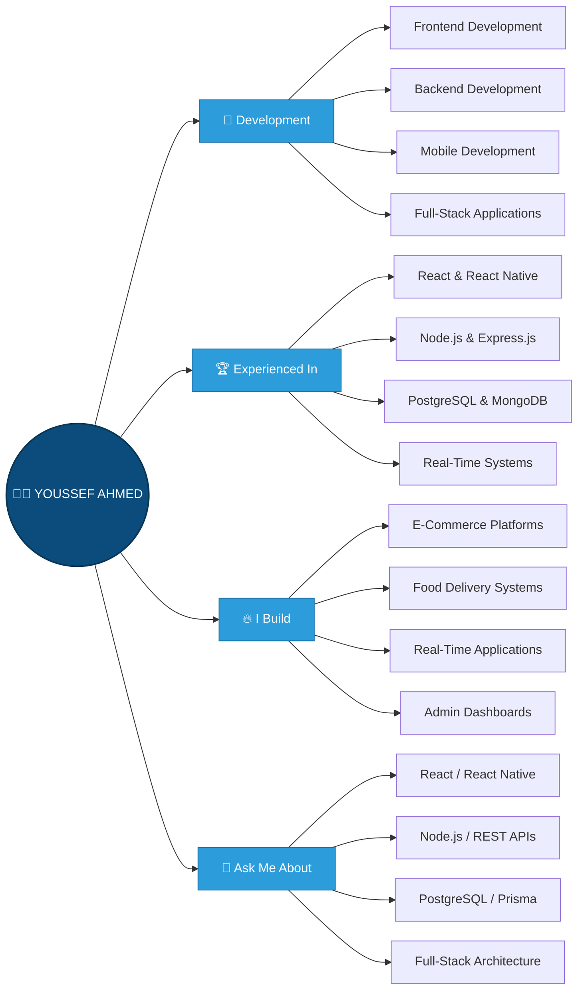

<!-- Header Section -->

<h1 align="center">
  
  Hi there! I'm Youssef Ahmed
</h1>

  

<h3 align="center">
  FULL-STACK DEVELOPER • FRONTEND • BACKEND • MOBILE
</h3>

  

---

  

  

---

## 👨‍💻 About Me

> 💻 Full-Stack Developer with 2 years of hands-on experience building scalable web and mobile applications using modern JavaScript technologies.

---

## 🛠️ Tech Stack & Skills

### 💻 Programming Languages:

### 🌐 Frontend Development:

 

### 📱 Mobile Development:

  
  

### ⚙️ Backend Development:

  
  
  
  

### 🗄️ Databases & ORM:

  
  
  

### 🔄 Real-Time & Communication:

  
  
  

### 💳 Third-Party Integrations:

  
  

### 🔧 Tools & Technologies:

---

## 🚀 Featured Projects

### 🍔 Full-Stack Food Delivery Ecosystem

**5 Platforms • 1 Shared Backend**

A large-scale food delivery ecosystem built from scratch using:

`React` `React Native` `Node.js` `Express.js` `PostgreSQL` `Prisma` `Socket.io` `PostGIS`

**Core Features:**

* 👤 Customer, Driver, Store Owner & Admin platforms
* 🚗 Real-time driver dispatch and Haversine matching
* 📍 Live GPS tracking and delivery history
* 💬 Order-scoped real-time messaging
* 🔔 Real-time notifications
* 🗺️ PostGIS delivery zones and geofencing
* 💳 Payment integration
* 💰 Wallet & commission ledger
* 🔐 JWT authentication and role-based access control
* 🏪 Multi-tenant restaurant, pharmacy & grocery architecture
* 📦 Product, inventory, cart and order management
* ⭐ Reviews, ratings and wishlists

---

## 📊 GitHub Stats

<table>
  <tr>
    <td width="50%" valign="top">

 

 

</td>

<td width="50%" valign="center">

</td>
</tr>
</table>

---

## 📈 Activity Graph

---

## 🎡 Current Focus

| 🚀 Focus               | 💻 Technologies                      |
| ---------------------- | ------------------------------------ |
| Full-Stack Development | React.js • Node.js • PostgreSQL      |
| Mobile Development     | React Native • Expo                  |
| Backend Architecture   | Express.js • Prisma • REST APIs      |
| Real-Time Systems      | Socket.io • GPS Tracking • Messaging |
| Database Architecture  | PostgreSQL • MongoDB • PostGIS       |
| Scalable Applications  | MERN • PERN • Multi-Platform Systems |

---

## 👁️ Profile Views

---

## 📊 Pacman Contribution Animation

<picture>
  <source
    media="(prefers-color-scheme: dark)"
    srcset="https://raw.githubusercontent.com/Youssef-Ahmed-Zahran/Youssef-Ahmed-Zahran/output/pacman-contribution-graph-dark.svg"
  />
  <source
    media="(prefers-color-scheme: light)"
    srcset="https://raw.githubusercontent.com/Youssef-Ahmed-Zahran/Youssef-Ahmed-Zahran/output/pacman-contribution-graph.svg"
  />
  
</picture>

> 🚀 Building scalable applications, solving real-world problems, and continuously improving as a Full-Stack Developer.

---

## 📫 Let's Connect!

**Let's build something great together! 🚀**

 

 

